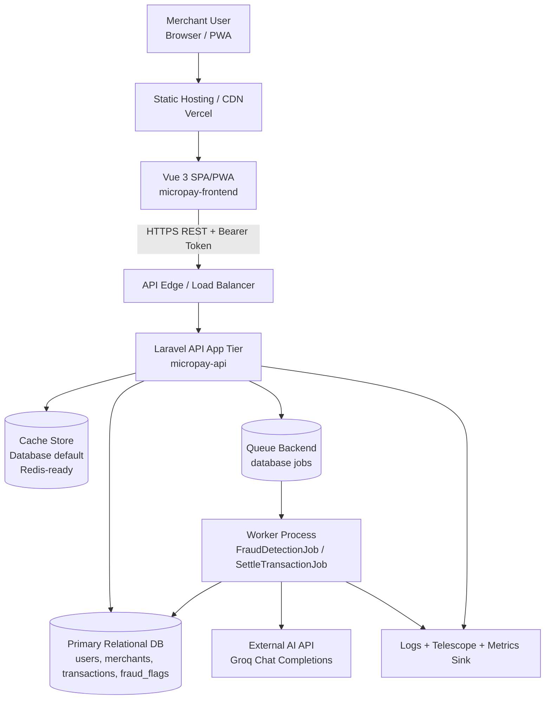
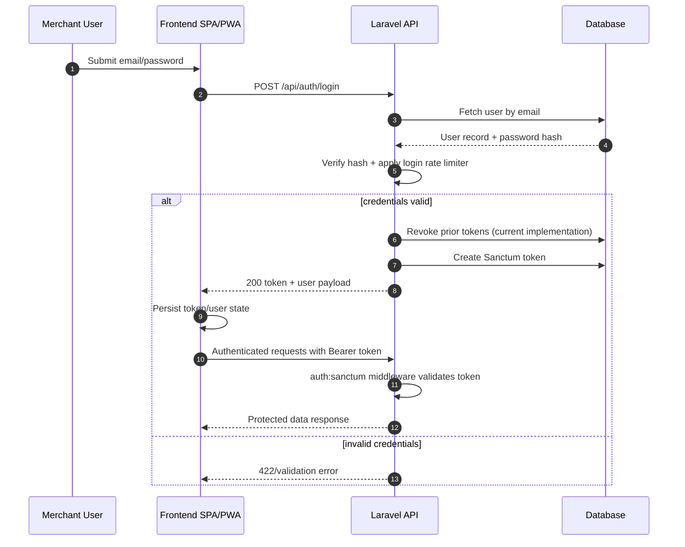
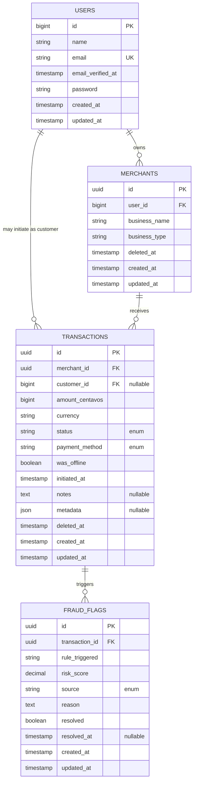
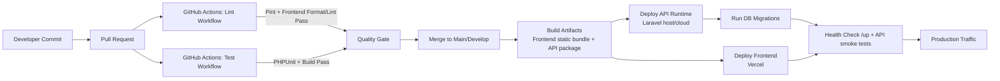

# MicroPay System Documentation

## 1. System Overview & Architectural Trade-offs

### 1.1 Purpose and Scope

MicroPay is a payment acceptance platform optimized for small and medium merchants that need:

- Fast digital payment capture (`qr_code`, `nfc`, `manual_entry`)
- Offline-first transaction capture from a Progressive Web App (PWA)
- Deferred fraud evaluation with deterministic rules plus AI-assisted assessment
- Merchant self-service transaction history and detail visibility

At a high level, the platform consists of:

- `micropay-frontend`: Vue 3 SPA/PWA deployed as static assets (Vercel-friendly)
- `micropay-api`: Laravel 13 API with Sanctum token auth, queue-backed fraud processing, and relational persistence

### 1.2 What the System Does

- Authenticates merchant users via API token flows (`/api/auth/*`)
- Manages merchant profiles (`/api/merchants`)
- Accepts single and batch transaction ingestion (`/api/transactions`, `/api/transactions/sync`)
- Performs transaction risk analysis via:
  - Rule engine checks
  - AI model call (Groq endpoint) when rules are triggered
- Persists fraud flags and transitions transaction status through the lifecycle
- Supports eventual synchronization of offline-captured transactions

### 1.3 What the System Does NOT Do (Current Boundaries)

- Does **not** directly integrate with acquiring banks/card networks for real fund movement settlement (status changes are internal workflow states)
- Does **not** provide multi-region active-active topology out of the box
- Does **not** currently enforce server-managed idempotency keys at API protocol level (idempotency is mostly achieved by client UUID uniqueness in sync flow)
- Does **not** implement a full event streaming backbone (Kafka/PubSub) for cross-service decoupling
- Does **not** provide guaranteed exactly-once processing semantics across all failure modes
- Does **not** expose a GraphQL or gRPC interface (REST only)
- Does **not** include a hardened secrets manager integration by default in repo configuration

### 1.4 Business-Critical Flows

- Merchant login/register -> token issuance -> protected dashboard access
- Transaction initiation -> pending state -> fraud check -> final disposition (`cleared` / `flagged` / `rejected`) -> optional settle transition
- Offline capture -> local encrypted queue -> batch sync with duplicate-skipping behavior

### 1.5 Architectural Trade-offs and Rationale

#### Trade-off A: Simplicity and Delivery Speed vs. Horizontal Throughput

- **Decision:** Laravel monolith with clear internal service boundaries.
- **Why it helps:** Faster development, lower cognitive overhead, easier onboarding.
- **Cost:** Write path and fraud logic share runtime boundaries; large-scale horizontal partitioning is less natural than in microservices.
- **Mitigation path:** Introduce queue workers and isolate hot paths first; split bounded contexts later only when operational pain justifies it.

#### Trade-off B: Cost-Controlled Default Infrastructure vs. Peak Performance

- **Decision:** Database-backed queue and cache defaults.
- **Why it helps:** Lower operational complexity and fewer moving parts.
- **Cost:** Database contention and queue latency increase under spike conditions.
- **Mitigation path:** Promote queue/cache to Redis, then dedicated queue infra when SLO pressure appears.

#### Trade-off C: Security Hardening vs. UX Convenience

- **Decision:** Bearer tokens persisted in browser storage for SPA convenience.
- **Why it helps:** Stateless API integration is straightforward; mobile/PWA UX is simple.
- **Cost:** XSS can elevate blast radius through token exfiltration.
- **Mitigation path:** Move to secure HttpOnly cookie strategy for first-party SPA or short-lived token + refresh token pattern with stricter CSP.

#### Trade-off D: Fraud Accuracy vs. Latency/Cost

- **Decision:** Rule engine first, AI invoked conditionally when rules trigger.
- **Why it helps:** Contains AI spend and keeps clean transactions fast.
- **Cost:** Fraud decisions rely on external AI availability/latency in flagged paths.
- **Mitigation path:** Add circuit breakers, async retries, and deterministic fallback decisions for degraded mode.

#### Trade-off E: Availability vs. Consistency in Offline Flow

- **Decision:** Allow offline capture and delayed sync.
- **Why it helps:** Merchant continuity in unstable connectivity regions.
- **Cost:** Backend visibility is eventually consistent until sync occurs; duplicate/conflict handling becomes mandatory.
- **Mitigation path:** Stronger idempotency contract and reconciliation jobs.

### 1.6 Technical Debt Snapshot

- Frontend auth token storage in `localStorage` increases XSS risk surface.
- Polling-based refresh in multiple views may produce avoidable request amplification at scale.
- Queue processing currently contains sync dispatch paths for fraud/settlement jobs, reducing true async decoupling under load.
- Mixed web-auth (Fortify/Inertia) and API-auth (Sanctum tokens) coexist; role boundaries are clear but operationally require disciplined endpoint separation.
- Repo includes hints of framework/config drift (e.g., Nuxt config artifact while primary frontend build is Vite).

---

## 2. System Architecture (Visual & Descriptive)

### 2.1 Macro Architecture Diagram



### 2.2 Component Responsibilities and Fault Tolerance

#### A. Client Tier (`micropay-frontend`)

- Responsibilities:
  - Authentication UX, token persistence, route access control
  - Payment capture, history, transaction detail rendering
  - Offline queueing and deferred sync behavior
  - PWA installability and service-worker-assisted caching
- Fault tolerance:
  - Offline-first queue preserves write intent during network loss
  - Dynamic import failure fallback hard reload logic for version drift
  - 401 interceptor fails closed by clearing auth state and redirecting login
- Limits:
  - Browser storage auth is durable but security-sensitive
  - Multi-tab polling can increase backend load

#### B. API Edge + App Tier (`micropay-api`)

- Responsibilities:
  - Token auth (`auth:sanctum`)
  - Input validation and response shaping
  - Merchant ownership/authorization checks
  - Orchestration of transaction lifecycle
  - Triggering fraud and settlement workflows
- Fault tolerance:
  - Rate limiters for login, transaction API, and sync endpoint to resist abuse
  - Validation-based rejection for malformed requests
  - Queue failure tables support reprocessing strategy
- Limits:
  - Monolithic runtime is operationally simple but can become hotspot-prone under high write concurrency

#### C. Queue/Worker Tier

- Responsibilities:
  - Off-request processing for fraud logic and disposition updates
- Fault tolerance:
  - Durable queue table with failed-job recording
  - Re-runnable job patterns can be introduced with idempotent guards
- Limits:
  - Current sync dispatch usage narrows async benefits unless moved to true background workers

#### D. Data Tier

- Responsibilities:
  - System of record for user, merchant, transaction, fraud signals
- Fault tolerance:
  - Soft deletes protect auditability
  - Relational constraints preserve integrity
  - UUID PKs reduce enumeration risk and support offline-generated identifiers
- Limits:
  - Single-primary assumptions unless explicitly upgraded to HA topology

#### E. External AI Dependency

- Responsibilities:
  - Supplemental fraud assessment and explainability signal
- Fault tolerance:
  - Should be wrapped with timeout/circuit-breaker/retry policy
  - Degradation mode should prefer deterministic rule engine path over write failure
- Limits:
  - Cost and latency variability
  - Third-party dependency and API quota risk

---

## 3. Security, Authentication & Threat Model

### 3.1 Security Perimeter

- Primary trust boundaries:
  - Browser/PWA boundary (untrusted client runtime)
  - API gateway/application boundary
  - Data boundary (DB, queue tables, logs)
  - External AI network boundary
- Security controls in place:
  - Sanctum-protected API routes
  - CORS allow-list with explicit origins and methods
  - Per-endpoint and per-user/IP throttling
  - Laravel validation and ORM parameterization patterns
  - Production password policy hardening

### 3.2 Authentication and Authorization Flow



### 3.3 Authorization Model

- API route groups require authentication middleware.
- Merchant data access is constrained by ownership checks (`merchant.user_id == auth user`).
- Team-based authorization middleware exists for broader role-based controls in web routes.
- Principle: deny-by-default for unauthorized resource ownership attempts.

### 3.4 Encryption Standards

#### In Transit

- Required baseline:
  - TLS 1.2 minimum, TLS 1.3 preferred
  - HSTS at edge for production domains
- API calls are expected via HTTPS only from frontend environments.

#### At Rest

- Current baseline:
  - Database-level at-rest encryption is infrastructure-dependent (must be enabled on managed DB volume/storage).
  - Application secrets in environment variables.
- Recommended hardening:
  - KMS-backed disk encryption
  - Secrets manager integration (rotation + access policy)
  - Field-level encryption for highly sensitive attributes if introduced later

### 3.5 Threat Model (STRIDE-Oriented)

#### Spoofing

- Risks:
  - Token theft from browser storage
  - Credential stuffing
- Controls:
  - Login throttling, token revocation on re-login
  - Recommendation: short-lived access tokens + refresh rotation, optional device binding

#### Tampering

- Risks:
  - Client payload manipulation
  - Offline queue tampering attempts
- Controls:
  - Strict server-side validation
  - Encrypted offline queue payloads in client
  - Recommendation: signed request hashes for offline sync batches

#### Repudiation

- Risks:
  - Disputes around fraud decision provenance
- Controls:
  - Fraud flags with source attribution (`rule_engine`, `ai_agent`, `manual`)
  - Audit-friendly status transitions and timestamps

#### Information Disclosure

- Risks:
  - XSS leading to token exfiltration
  - Log leakage of sensitive identifiers
- Controls:
  - No unsafe HTML rendering pattern by default in core frontend flows
  - Recommendation: strict CSP, output encoding review, sensitive log redaction policy

#### Denial of Service

- Risks:
  - Sync endpoint abuse triggering expensive fraud evaluation
  - Request floods
- Controls:
  - Transaction and sync endpoint rate limiting
  - Recommendation: WAF + adaptive rate policies + queue depth autoscaling

#### Elevation of Privilege

- Risks:
  - Access to merchants not owned by requesting user
- Controls:
  - Ownership checks in controller paths
  - Team role checks where team middleware is applied

### 3.6 Injection, XSS, and Unauthorized Data Access Mitigations

- Injection:
  - ORM + query builder patterns reduce raw SQL exposure
  - Form request and inline validation reject malformed input
  - Recommendation: ban raw queries unless explicitly parameterized and reviewed
- XSS:
  - Vue template escaping by default
  - Recommendation: CSP (`default-src 'self'`; strict script policies), dependency scanning, secure headers at edge
- Unauthorized data access:
  - Route middleware + resource ownership checks
  - Recommendation: centralized policy classes for every entity and automated authorization tests

---

## 4. Data Architecture & Persistence

### 4.1 Core Data Model



### 4.2 Persistence Strategy

- Relational-first modeling for transaction integrity and auditability.
- UUIDs on payment/fraud entities support:
  - Offline-safe ID generation
  - Lower predictability vs incremental IDs
- Soft deletes used for merchant and transaction retention patterns.

### 4.3 Indexing Strategy

Current indexes (transaction-centric):

- `transactions(merchant_id, status)` for dashboard filtering
- `transactions(status, created_at)` for status-age and monitoring queries
- `transactions(initiated_at)` for chronology/risk analytics
- standard FK indexes from relational constraints

Recommended index evolutions as scale grows:

- Partial index equivalents for hot statuses (`pending`, `fraud_check`) where supported
- Composite index on `(merchant_id, created_at DESC)` for history pagination
- Covering index for common list projections to reduce heap lookups

### 4.4 Caching Layers

- Current default cache driver: `database`.
- Practical role today:
  - Framework and app-level low-cardinality caching opportunities
- Recommended evolution:
  - Move cache/session/queue to Redis in production for latency and lock efficiency
  - Introduce explicit cache keys and TTL strategy for merchant dashboards
  - Add cache invalidation contracts near write paths

### 4.5 Data Retention and Lifecycle

- Transactions/fraud records are audit-sensitive and should follow long-lived retention.
- Suggested retention policy (example baseline):
  - Raw transaction/fraud records: 7+ years (jurisdiction dependent)
  - Operational logs: 30-90 days hot, then cold archive
  - Failed jobs: retain until triage + bounded retention for storage hygiene
- Introduce data classification matrix (PII, financial, operational metadata) with per-class retention and masking requirements.

### 4.6 Backup and Disaster Recovery

#### Baseline Requirements

- Daily full backups + frequent incremental/WAL-based backups
- Encrypted backup storage and key separation
- Cross-zone or cross-region backup replication

#### Recovery Objectives (Target)

- RPO: <= 15 minutes for primary financial records
- RTO: <= 60 minutes for API write restoration

#### DR Protocol

1. Detect DB incident via synthetic write/read health checks and connection pool errors.
2. Quarantine write traffic (maintenance mode or graceful degraded reads).
3. Promote standby or restore latest consistent backup + logs.
4. Validate schema version and integrity checks.
5. Replay queued operations safely with idempotency guard.
6. Re-enable writes progressively and monitor error budget burn.

---

## 5. API Design & Inter-service Communication

### 5.1 Communication Protocols

- External and client-facing: REST over HTTPS, JSON payloads.
- Internal orchestration: in-process service calls + queue-dispatched jobs/events.
- Not currently used: gRPC, GraphQL.

### 5.2 API Resource Design

- Auth:
  - `POST /api/auth/register`
  - `POST /api/auth/login`
  - `POST /api/auth/logout`
  - `GET /api/auth/me`
- Merchant:
  - `GET/POST /api/merchants`
  - `GET/PATCH/DELETE /api/merchants/{merchant}`
- Transactions:
  - `GET/POST /api/transactions`
  - `GET /api/transactions/{id}`
  - `POST /api/transactions/sync`

Design characteristics:

- Resource-oriented routes
- Validation-first request handling
- Explicit 201/403/404/409 response usage in key paths

### 5.3 Idempotency Strategy

Current behavior:

- Offline sync uses client-generated UUIDs and duplicate-skip lookup by transaction ID.
- Repeated sync payloads with same UUID are effectively ignored for existing records.

Recommended production contract:

- Require `Idempotency-Key` header for write endpoints.
- Persist key + request hash + response snapshot for bounded TTL.
- Return original response on duplicate key with matching hash; reject hash mismatch.

### 5.4 Rate Limiting Strategy

Implemented:

- `login`: 5/min keyed by username+IP
- `two-factor`: 5/min keyed by login session id
- `transaction-api`: user + IP layered limits
- `sync-endpoint`: 3/min per user/IP context

Recommended extensions:

- Tiered limits by merchant risk profile
- Dynamic tightening during anomaly windows
- Global per-origin limits at edge/WAF

### 5.5 Standard Error Payload Structure (Recommended Contract)

Current responses vary by context (Laravel validation shape + custom messages). Standardize to:

```json
{
  "error": {
    "code": "TRANSACTION_VALIDATION_FAILED",
    "message": "Payload failed validation.",
    "details": {
      "amount_centavos": ["The amount_centavos field is required."]
    },
    "request_id": "d4b9d3e0-8d34-4d27-9ef8-cf4e2c2fa8f1",
    "retryable": false
  }
}
```

Benefits:

- Better frontend error UX mapping
- Cleaner observability and incident triage
- Consistent downstream integration behavior

### 5.6 Inter-service Communication Reliability Considerations

- Event-to-job orchestration should be non-blocking in production worker mode.
- Add retry policies with backoff and dead-letter handling for external AI calls.
- Tag all jobs with correlation IDs for end-to-end traceability.

---

## 6. Infrastructure, CI/CD & Deployment

### 6.1 Deployment Pipeline



### 6.2 Runtime and Packaging

- Frontend:
  - Vite build output, SPA rewrite strategy on host
  - PWA via `vite-plugin-pwa` with runtime caching and fallback behavior
- Backend:
  - Laravel runtime, queue worker process required for scalable async behavior
  - CI matrix includes PHP version compatibility testing

### 6.3 Environment Strategy

- Local/dev defaults emphasize convenience:
  - SQLite, database queue/cache/session
- Production expectations:
  - Managed relational DB
  - Hardened TLS and origin controls
  - Dedicated queue workers
  - Secret injection via secure environment management

### 6.4 Scaling Triggers and Policies

Suggested autoscaling triggers:

- API pod/instance scale out:
  - CPU > 65% sustained 5m
  - P95 latency > 400ms sustained 5m
  - Error rate > 2% sustained 5m
- Worker scale out:
  - Queue depth > 500 jobs for 3m
  - Oldest job age > 60s sustained
  - Fraud job processing time p95 > target
- DB scaling:
  - Connection saturation > 80%
  - Replication lag above SLO thresholds
  - IO wait and lock contention trends

### 6.5 Containerization and Orchestration Strategy (Target State)

If moving to containerized production:

- Build separate images:
  - `api-web` (Laravel HTTP)
  - `api-worker` (queue worker)
- Orchestrate with Kubernetes/ECS:
  - HPA for web and workers
  - Separate resource profiles for CPU vs. IO-bound components
  - Rolling deployments with readiness/liveness probes
- Use migration job as controlled pre-deployment step with rollback guardrails.

### 6.6 Release Strategy and Rollback

- Preferred release: blue/green or canary for API tier.
- Rollback conditions:
  - SLO breach during bake window
  - Elevated auth failures
  - Fraud pipeline timeout surge
- Rollback mechanism:
  - Revert app version first; avoid automatic schema rollback unless migration is backward-safe.

---

## 7. Observability & Runbooks

### 7.1 Observability Strategy

Telemetry pillars:

- Metrics: latency, throughput, error rates, queue depth, DB pool health
- Logs: structured app and job logs with correlation IDs
- Traces: request -> service -> job -> external AI call spans
- Domain events: transaction lifecycle transitions and fraud outcomes

### 7.2 Critical SLIs and SLOs

#### SLI Set

- API availability (successful responses / total requests)
- API latency (p50/p95/p99 for write and read endpoints)
- Auth success ratio (excluding invalid credential expected failures)
- Transaction ingest success rate (`POST /transactions`)
- Sync success rate (`POST /transactions/sync`)
- Queue health (depth, age, failure ratio)
- Fraud decision completion time
- DB connectivity success rate and pool utilization

#### SLO Targets (Example Production Baseline)

- API availability: >= 99.9% monthly
- `POST /transactions` p95 latency: <= 400ms
- `GET /transactions` p95 latency: <= 300ms
- Fraud decision completion: 99% <= 10s end-to-end
- Queue oldest job age: <= 60s for 99% of intervals
- DB connection failure rate: < 0.1% of attempts

### 7.3 Alerting Thresholds (Actionable, Not Noisy)

Page-worthy alerts:

- API 5xx error rate > 5% for 5 minutes
- Auth/login failure spike > 3x baseline with broad IP distribution
- Queue oldest job age > 180s for 10 minutes
- Failed jobs growth slope > threshold (e.g., >100 in 10 minutes)
- DB connection utilization > 90% for 5 minutes
- External AI timeout rate > 20% for 10 minutes

Ticket-worthy alerts:

- p95 latency regression > 30% day-over-day
- Cache hit rate degradation below target baseline
- Elevated 429 rates for legitimate merchant cohorts

### 7.4 Logging Requirements

- Log every transaction state transition with:
  - `transaction_id`, `merchant_id`, prior/new status, processing phase, `request_id`
- Log AI call outcomes:
  - latency, model, timeout/error class, fallback path selected
- Log auth events:
  - login success/failure counters (without credential leakage)
- Redact:
  - tokens, secrets, sensitive PII fields

### 7.5 Runbook: Total Database Connection Failure

#### Trigger Condition

- API error burst indicates DB connection exceptions across most endpoints.
- Health checks fail read/write probes.

#### Immediate Response (0-5 Minutes)

1. Declare incident and assign incident commander.
2. Verify blast radius:
   - Are all API endpoints impacted or only write paths?
3. Shift system into protective mode:
   - Return graceful maintenance responses for write endpoints.
   - Keep static frontend available with explicit degraded messaging.
4. Freeze non-essential deploys and migrations.

#### Diagnosis (5-15 Minutes)

1. Validate DB service health (provider status, node health, network ACLs, credentials expiry).
2. Check connection pool exhaustion and sudden traffic anomalies.
3. Validate DNS/network path from app tier to DB endpoint.
4. Inspect recent changes:
   - Connection string/secrets rotation
   - Firewall/security group modifications
   - App release causing leaked connections

#### Recovery (15-45 Minutes)

1. If primary DB is down, promote standby or restore from latest healthy point.
2. Reconfigure application connection target if failover endpoint changed.
3. Gradually restore read traffic, then controlled write traffic.
4. Restart workers after DB stability to prevent thundering herd.
5. Drain backlog in bounded batches and monitor lock/contention behavior.

#### Validation and Exit

1. Confirm:
   - DB connection error rate back within SLO.
   - Transaction writes succeed with expected latency.
   - Queue age returns to normal.
2. Close incident only after sustained stability window (e.g., 30-60 minutes).

#### Post-Incident Actions

- Publish RCA with timeline, root cause, and preventive actions.
- Add chaos test for DB unavailability scenario.
- Implement automated failover playbook where feasible.
- Tighten dashboard alerts around early warning signals (connection retries, pool saturation).

---

## Appendix A: Current Technology Stack (As Implemented)

- Frontend:
  - Vue 3, Vite, Vue Router, Pinia, Axios, Tailwind CSS v4, Vite PWA plugin
- Backend:
  - Laravel 13, PHP 8.3+, Sanctum, Fortify, Telescope
- Data and jobs:
  - Relational DB (SQLite defaults in template), database-backed queue/cache/session defaults
- CI:
  - GitHub Actions for tests and linting/formatting checks
- External dependency:
  - Groq AI API for enhanced fraud reasoning

## Appendix B: Production Hardening Checklist (Recommended Next)

- [ ] Migrate auth from browser token storage to secure cookie or short-lived token + refresh model
- [ ] Enforce strict CSP and secure headers (CSP, HSTS, X-Frame-Options, Referrer-Policy)
- [ ] Move queue/cache/session to Redis in production
- [ ] Standardize API error envelope with machine-readable error codes
- [ ] Implement `Idempotency-Key` protocol for all write endpoints
- [ ] Add circuit breaker and fallback mode for external AI dependency
- [ ] Introduce correlation IDs and distributed tracing
- [ ] Define and enforce backup restore drills quarterly
- [ ] Expand automated authorization/integration tests around ownership and fraud workflows
